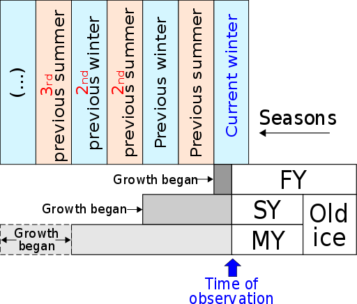

# Sea Ice Reference Ontology Annotation

Named entity annotation for the sea ice reference ontologies is a specialized task, the ultimate goal of which is to move towards the ability to automatically generate the [OWL language ontologies](https://en.wikipedia.org/wiki/Web_Ontology_Language) needed not just to facilitate cross-domain data discovery and use; but also to generate open-linked data as well (where appropriate).  As such, the scope of the task is restricted to only annotating those terms from specific sections of the [WMO Nomenclature document](https://www.wmo.int/pages/prog/www/OSY/Meetings/GCW-CN1/INF28_Sea_ice_standards.pdf) from which these [ontologies](https://github.com/rduerr/ssiii/tree/master/ontology) were derived:

* Section 1, 

* Section 2 (but not section 2.7 or 2.8), 

* Section 4.2

* Section 4.3.1

* Section 4.3.2

* Section 4.3.4 (but not 4.3.4.1)

* Section 4.3.5

* Section 4.3.6

* Section 4.3.7 (skip 4.3.7.3 through 4.3.7.8 and 4.3.7.10 - 4.3.7.14)

Entities are the main things annotated, while properties are used to describe or characterize relationships between entities and to specify values in these relationships where relevant.  For example, in a discussion about cars and their colors, both the words "car" and “color” would be general entities and there might be the property hasColor,  In that case, the sentence “My car is blue”, would be annotated as:

[My car] is [blue].  Where [My car] would have the general_entity "car"; [blue] would have the general_entity “color”; and the property hasColor for the entity [My car] would be [blue].

It should be noted that you can not annotate a property unless there has been a general entity tagged (i.e., can’t say hasColor blue unless "blue" has been tagged as a color).

# The Sea Ice Ontologies

There are many tools that can be used to display the relationships between terms within a suite of ontologies.  Protege is one such tool and the tool that was used in generating the ontologies in the first place.  When displayed, the top level terms are depicted in the figure below.  The part of the ontologies that we are interested in here are the terms under the Sea Ice concept described below (which will be relabeled "ice" in the next version of the ontologies). In other words the ‘forms of floating ice’, the ‘ice with concentration’, and the ‘ice with development stage’ concepts and their subconcepts. 

# 

# Selecting Span

1. **Span Information**

A span refers to the section of the text that is annotated. Different projects will have different methods for defining the proper span for that project. For Clear Earth annotation, we are primarily capturing **minimum spans** with a few exceptions. A minimum span is one in which only the syntactic heads are annotated. (This generally results in single-word annotations.) 

	

The head of a phrase is the word that determines what syntactic type of phrase it is. 

For example, in the sentence:

 "Our neighbor [John] bought a new, green [car]." 

We have "our neighbor John" in which the syntactic head of the noun phrase (NP) is the proper noun “John” and we have the NP “a new, green car” in which the head is the noun “car.”  

We can also think of the head of a phrase as the word that provides the essential meaning of the phrase. Take the NP "a new, green car" for example. What is essential to our understanding of what exactly John bought is the head “car.” Although the dependents or pre-modifiers “new” and “green” give us additional information, they are less essential to our interpretation of the sentence. 

	

This is important to know because **we only annotate words that are the syntactic head of the phrase themselves:**

Example of a markable, syntactic head of an NP:

	

This massive [iceberg]ICE_FORM was first observed in the Arctic Ocean in September 2010. 

*We tag "iceberg" as the **ICE_FORM** because it is the head of the NP, but we do not tag the determiner “the” or the adjective “massive.” They are not part of the minimum span. *

	

Exceptions to the rule of grabbing the syntactic head only:

        1. **There are certain multiword expressions (MWE) that we treat as though they are minimum spans and annotate the complete phrase. **These MWEs are organized according to three categories: ice form, ice development and ice concentration and they can be found listed in diagrams in the *General Entities* section below. 

*Examples:*

    * [First-year ice]ICE_DEVEL is [sea ice]ICE_FORM of not more than [one winter’s growth]AGE, developing from [young ice]ICE_DEVEL; thickness [30 cm]THICKNESS - [2m]THICKNESS. May be subdivided into [thin first-year ice]ICE_DEVEL / [white ice]ICE_DEVEL, [medium first-year ice]ICE_DEVEL and [thick first-year ice]ICE_DEVEL. 

				

				In the example above, we have the following 

multiword expressions: [first year ice], [sea ice], [one winter’s growth] (NOTE:  This multiword expression will not be found in the diagrams on pages 12 and 14, but should still be treated as an MWE.), [young ice], [thick first-year ice], [white ice], [medium first-year ice] and [thick first-year ice]. 

        2. **We always want to capture the full quantitative measurements of distance or amounts. **

			

		*	Examples:*

* [First-year ice]ICE_DEVEL is [sea ice]ICE_FORM of not more than [one winter’s growth]AGE, developing from [young ice]ICE_DEVEL; thickness [30 cm]THICKNESS - [2m]THICKNESS.

			In the example above we want to make sure to 

annotate a measurement value and unit. In this example, the value is 30 and the unit is cm.

# General Entities

The top level entity that we will be annotating is the word "ice" and we only annotate it if it is the syntactic head of a phrase.  Why?  Because typical phrases with the term ice in them will likely be annotated in future schemas.  For example, ice edge is not a term in this schema but is likely to be in the more general ice schema of the future.

**Ice** refers to any frozen form of water.  In the context of the WMO sea ice nomenclature this is typically limited to floating ice in an ocean.

Example:

* Because so much [ice]ice had melted out during the previous summer, a vast expanse of ocean was exposed to low winter air temperatures, encouraging ice growth. 

When describing a bounded region region of the ocean (e.g., a bay or sea or the whole ocean), there are three main characteristics of the entire set of ice within that region in common use within the sea ice community:

1. **Ice concentration** - or how much of the surface of the region is covered by ice;

2. **Ice stage of development** - rough proxy for the age of the ice in that region, since ice forms and degrades in well-described ways

3. **Ice form** or the form of the ice - a rough description of the areal extent or size of the pieces of ice in the region (I.e., is there only one really big piece or is the ice in small chunks or even as slush on the surface of the water)

**Ice Form*** *refers to the extent or size of any chunk of ice floating in water. The principal kinds of floating ice at the sea surface are sea ice which is formed by the freezing of seawater at the surface, lake ice and river ice formed on rivers or lakes and glacier ice (ice of land origin).

**The defined entity terms related to the f****orm of the sea ice in ****a region are**:

*See definitions for these terms in the glossary.*

*Examples:*

* [Ice of land origin]ICE_FORM: [Ice]ICE formed on land or in an [ice shelf]ICE_FORM, found floating in water. The concept includes [ice]ICE that is stranded or grounded. 

* [Floe]ICE_FORM: Any contiguous piece of [sea ice]ICE_FORM. 

* Pressure ridge: process that occurs when wind, ocean currents, and other forces push [sea ice]ICE_FORM around into piles that rise and form small mountains above the level [sea ice]ICE_FORM surface; ridges are initially thin and transparent with very sharp edges from blocks of [ice]ICE piling up; also see keels.

**Ice Development (the age of the ice)**** **or Ice Stage of Development is a phrase used to classify sea ice for operational purposes using the appearance and thickness of the ice as a proxy for its age. 

These terms are derived from understanding how many winter and/or summer seasons the ice has lived.  A nice graphic depicting the major ice development terms and how they relate to the number of winter freezing seasons or summer melting seasons the ice has lived through comes from wikipedia:

 (NOTE:  By Lusilier (Own work) [CC BY-SA 3.0 (http://creativecommons.org/licenses/by-sa/3.0)], via Wikimedia Commons)

Figure 1: In this diagram FY stands for First-year Ice, SY for Second-year Ice, and MY for Multi-year Ice

**The entity terms related to the age of the sea ice in a region defined in the ontologies are**:

*See definitions for these terms in the glossary.*

*Examples:*

* An [ice rind]ICE_DEVEL is a brittle shiny crust of [ice]ICE formed on a quiet surface.

* [Gray ice]ICE_DEVEL is [young ice]ICE_FORM that is [10]THICKNESS - [15 centimeters]THICKNESS thick.

**Ice concentration**** **refers to the concentration of ice in a region not as a measurement but as a term.

**The defined entity terms related to the concentration of the sea ice in a region are**:

*See definitions for these terms in the glossary.*

*Examples:*

* [Consolidated ice]ICE_CON is [floating ice]ICE_FORM in which the concentration is [10/10]CONCENTRATION and the [floes]ICE_FORM are frozen together.

**Concentration** is the ratio expressed in tenths describing the amount of the sea surface covered by ice as a fraction of the whole area being considered.

*Examples:*

* [Open water]ICE_CON is a large area of freely navigable water in which [sea ice]ICE_FORM is present in concentrations less than [1/10]CONCENTRATION.

* [Consolidated ice]ICE_CON is [floating ice]ICE_FORM in which the concentration is [10/10]CONCENTRATION and the [floes]ICE_FORM are frozen together. 

**Extent** is the amount of area covered by sea ice.

*Examples:*

* [Shuga]ICE_DEVEL is an accumulation of spongy white ice lumps, a [few centimeters]EXTENT across.

* [Floe giants]ICE_FORM can be over [10 km]EXTENT across.

* [Sea ice]ICE_FORM extent for July 2013 averaged [8.45 million square kilometers]EXTENT ([3.26 million square miles]EXTENT).

**Thickness** describes how thick the ice is.  Two forms of reference are commonly used.  The first is how much of the sea ice is above sea level (typically measured in centimeters or meters).  The second is the total thickness of the ice (also usually measured in centimeters).  The first type of reference is typically used for very thick ice where the total thickness is hard to observe; but can be estimated using the rubric that 9/10ths of the ice will be under the water.  The second is typically used where the ice is thin enough to be easily measured.

*Examples:*

* If it is thicker than about [2 meters]THICKNESS above sea-level it is called an [ice shelf]ICE_FORM.

* [Nilas]ICE_DEVEL has a matt surface and is up to [10 centimeters]THICKNESS in thickness.

**Age** describes how many melting seasons or years the sea ice has survived (first-year, second-year, multi-year, etc.).  In some cases, figuring out what the significant phrase denoting the age of the ice can be tricky, since it requires understanding whether a freeze up or melting season is what distinguishes this name from others (see the last example).

*Examples:*

* [Fast ice]ICE_FORM may be more than [one year old]AGE.

	

* [Old ice]ICE_DEVEL is [sea ice]ICE_FORM which has survived at least [one summer’s melt]AGE.

* [Residual ice]ICE_DEVEL: [First-year ice]ICE_DEVEL that has survived the [summer’s melt]AGE and is now in the [new cycle of growth]AGE. 

What this last example is trying to say is that if "First-year ice" survives through the summer into the next winter’s growth period it’s name is no longer “First-year ice” but now becomes “Residual ice”; so the trigger for the name change (and the age) is the phrase [new cycle of growth].

# Tricky Cases

When annotating the WMO Nomenclature, an annotator will likely encounter several confusing sentences.  Sentences which may leave the annotator scratching their heads trying to decide what if anything to annotate and how in general that sentence should be annotated.  While any annotator is likely to encounter a few cases where no amount of guidance can help, where possible (in other words where we were able to figure out a rule folks could use) the rules encapsulated in this section should be used to help with decisions in these tricky cases.

1. Defined Terms versus Modifiers

Each of the terms Ice Form (ice_form in Anafora), Development Stage (ice_devel in Anafora), and Ice Concentration (ice_con in Anafora) have an explicitly agreed to set of names defined in the ontologies.  If any term or set of terms is not explicitly mentioned in the lists below then it should NOT be annotated as one of these entities, even if from the context you might think that it should be. 

You can find a list of terms for ice forms on page 12, ice development stage terms on page 14, and ice concentration terms on page 14. 

*Examples:*

* Thicker ice underneath the melt pond bottom...

In the phrase above, thicker just implies that the ice is thicker, it isn’t a form of ice - rather it is a property of the ice - the thickness property (see thickness discussion below). In this phrase, we would only annotate [ice]ICE. 

* The response of the albedo of bare sea ice..

Bare sea ice is not a form of ice.  It is just sea ice without snow on top; you wouldn’t call snow-covered sea ice a form of sea ice for the same reason you wouldn’t call snow covered granite a type of rock. In this phrase, we would only annotate [sea ice]ICE_FORM.

* The effects of additional black carbon on the albedo of Arctic sea ice …

The modifier "Arctic" is a location so is not included in the span of the ICE_FORM annotation for the [sea ice] entity.

2. When to annotate a modifier within a long string of modifiers:

Long modifier strings are common in journal articles. They are used as shortcuts or ways to minimize the number of words used to characterize an object.  So in general, try to pull apart the various concepts that are all lumped together and annotate the separate concepts.  One way to do this would be to see if the sentence can be rewritten with each concept in a separate clause.

For example, we could rewrite the phrase below:

*Regional melt-pond fraction and albedo of thin Arctic first-year drift ice in late summer *

As:

*Regional melt-pond fraction and albedo of first-year ice in the Arctic that is thin and drifting.*

As a result, this sentence should be annotated as:

Regional melt-pond fraction and albedo of [thin] Arctic [first-year] [drift ice]ICE_CON]ICE_DEVEL in late summer. 

The entities (NOTE:  Please find more information on entities on page 9.) that should be annotated are [thin first-year ice]ICE_DEVEL as a discontinuous span and [drift ice]ICE_CON.

Let’s rewrite the sentence below:

*Field observations suggest a pronounced difference in the seasonal evolution of first-year sea-ice albedo.*

*		*As:

Field observations suggest a pronounced difference in the seasonal evolution of the albedo in [first-year] [sea-[ice]ICE_DEVEL]ICE_FORM.  

The entities that should be annotated are [first-year ice]ICE_DEVEL as a discontinuous span and [sea-ice]ICE_FORM.

3. How to annotate an entity that is a part of a discontinuous span:

Discontinuous spans add an extra step to entity annotation. A discontinuous span is a span that is interrupted in some way (see example immediately below). In sea ice annotation, we frequently find that the entity we’d like to tag is discontinuous because of a conjunction or a hyphen or some intervening adjectives.  An annotator can capture the complete span by linking (or adding) the disparate parts of the span together.

*Example:*

	Thick first year ice/ white ice : first year ice is 30 - 70 cm thick.

[Thick first-year ice / white ice]ICE_DEVEL:[first-year ice]ICE_DEVEL is [30]THICKNESS - [70 cm]THICKNESS thick. 

There are two THICKNESS entities in the phrase [30 - 70 cm]. To capture the full span [30 cm], we have to create a discontinuous span that links [30] to [cm]. Then we tag the continuous span [70 cm] as THICKNESS as well.

If there are multiple choices for completing a discontinuous span, choose the closest one.

*Example:*

May be subdivided into [residual]ICE_DEVEL, [second-year [ice]]ICE_DEVEL and [multi-year ice]ICE_DEVEL. 

The term [residual ice]ICE_DEVEL is missing the word [ice] which is present in the other two terms. 

4. How to treat illogical or mixed terminology:

As you might expect sometimes a vocabulary or glossary is updated in a way that actually makes things more not less confusing.  The underlying sea ice ontology used as the reference here was developed with a slightly older WMO nomenclature document than the WMO nomenclature document being annotated and I am sorry to say it; but in some cases the terminology became worse not better in that new version.  As a result, follow the ontology diagrams not the document when annotating.  For example, if the ontology says the term is a form of ice but the document seems to be indicating something else, go by the ontology.

For example, in the old version of the nomenclature and in the ontologies the term "pack ice" indicated freely floating ice that had a variety of concentrations (and terms for each concentration range).  As a result it should be annotated as ICE_CON in Anafora; despite the fact that the new version of the WMO Nomenclature uses a definition that indicates that it is an ice form.  

Drift Ice & Pack Ice - We can consider mentions about drift ice or pack ice to be synonymous. WMO changed the nomenclature after the reference ontology was developed, and we see both terms used in academic journals and even some very strange mixes of old and new.

	Example: The average [open-water]ICE_CON fraction of fowi=11 % was 

characteristic of [very close drift ice]ICE_CON 

**Note: **The correct phrase should have been "very close pack ice".

Do not annotate instances that mix multiple categories together like "bare white ice" or “summer sea ice.” At this time, only the phrases in the ontology (see below) should be annotated without the extra modifiers (in our examples, “white ice” and “sea ice” would be annotated).  However, we would tag an instance of a phrase in which the words in the term or phrase are out of order like “sea pack ice” for example. 

Watch out for terms like "younger ice" which seem as though they are referring to young ice (which would receive an ICE_DEVEL tag); but which actually are talking about the combination of several of the ice_devel categories (in the case where this example was drawn; all of the non-multiyear categories was meant).

5. How to Assign Properties to Entities:

The normal rule is to annotate properties for entities within the same paragraph or section.  Don’t go to other paragraphs to associate properties with an entity.  

Occasionally multiple mentions of an entity will occur within a paragraph.  These can share the same properties so that they are annotated the same way each time they are encountered in that paragraph.  

6. How to Assign Properties to Entities: Left-to-Right Annotation Rule:

The first mention of an entity in a paragraph or section receives all of the properties associated with that entity within a section (or all the relevant properties to its right). The second mention receives only the relevant properties to its right (ignoring all the properties that came before it on the left). And so on and so forth. 

*Example:*

[Fast ice]ICE_FORM: [Sea ice]ICE_FORM which forms and remains fast along the coast, where it is attached to the shore, to an ice wall, to an ice front, between shoals or grounded [icebergs]ICE_FORM. Vertical fluctuations may be observed during changes of sea-level. [Fast ice]ICE_FORM may be formed in situ from sea water or by freezing of [floating ice]ICE_FORM of any age to the shore, and it may extend a [few meters]EXTENT or [several hundred kilometres]EXTENT from the coast.

We have two mentions of fast ice in the example above. The first mention [fast ice] will receive all of the relevant property tags to the right in the text. These properties are: [sea ice], [floating ice], [few meters], [several hundred kilometers]. Then there is a second mention of [fast ice] later in the section. This mention will receive all the relevant property tags to **its right**, which are: [few meters] and [several hundred kilometers].

# Properties

Many of the properties have upper and lower values (e.g., upper_concentration).  However, unless from the text it is clear that a value mentioned is actually the highest (or lowest) value for a property of that type of object, do not annotate it as a property.

**Upper_concentration** refers to the highest concentration that a particular ice form can have. What constitutes that upper concentration varies depending on the form of the ice being described. 

For example, if a sentence describing drift ice/pack ice states that the concentration of that sea ice is measured at 3/10 then that instance of the term drift ice/pack ice would not receive the upper_concentration tag since the highest concentration for this ice form is 7/10 or more by definition. Interestingly, we can think of "no ice" as a kind of ice form with 0/10 being the highest concentration possible. 

*Examples:*

* The [sea ice]ICE_FORM concentration was estimated to be [3/10]CONCENTRATION in the the region near the island.
  * But [sea ice] would not have either the max_concentration or min_concentration properties.
* When concentrations are [high]CONCENTRATION, i.e. [7/10]CONCENTRATION or more, [drift ice]ICE_CON may be replaced by the term [pack ice]ICE_CON.
* [Ice free]<subCONCENTRATION means there is [no ice present]CONCENTRATION.

**Lower_concentration** refers to the lowest concentration that a particular ice form can have. What constitutes the lowest concentration varies depending on the ice form being described. 

For example, 7/10 is a high concentration for drift ice, but that same measurement for pack ice would warrant a lower_concentration tag as that would be a low concentration for pack ice. 

*Examples:*

* [Drift ice]ICE_CON/ [pack ice]ICE_CON: Term used in a wide sense to include any area of [sea ice]ICE_FORM other than [fast ice]ICE_CON no matter what form it takes or how it is disposed. When concentrations are [high]CONCENTRATION, i.e. [7/10]CONCENTRATION or more, [drift ice]ICE_CON may be replaced by the term [pack ice]ICE_CON. 
  * *This example is interesting. When you annotate [drift ice] as an ice concentration, you should also give it the property tag upper_concentration for [high] and [7/10] or more. When you annotate [pack ice] as an ice concentration you should also give it a property tag for [high] and [7/10 or more] for lower_concentration because that is a low measurement for that kind of ice form.  *

**Upper_extent** refers to the measurement of an ice form’s diameter or length in which the measurement is on the high or upper end of the range for that particular form. What constitutes the upper end of that range will vary depending on the ice form. 

*Examples:*

* [Pancake ice]ICE_FORM is predominantly circular pieces of ice from [30 cm]EXTENT - [3 m]EXTENT in diameter.
  * *When you annotate [pancake ice] as ice form, you should also give it the property tag upper_extent for [3 m] because 3 meters is the high end of the range ( 30 cm - 3 m) for pancake ice.  See below for the lower_extent annotation needed here as well.*

**Lower_extent** refers to the measurement of an ice form’s diameter in which the measurement is on the low end of the range for that particular form. What constitutes the lower end of that range will vary depending on the ice form. 

*Examples:*

* [Pancake ice]ICE_FORM is predominantly circular pieces of [ice]ICE from [30 cm]EXTENT - [3 m]EXTENT in diameter.
  * *When you annotate [pancake ice] as ice form, you should also give it the property tag lower extent for [30 cm] because 30 centimeters is at the low end of the range for pancake ice.  See above for the upper_extent annotation also needed.*

**Upper_thickness_asl** refers to the measurement of how thick the ice is **above sea level** and is on the high end of the range for that particular ice form. 

*Examples:*

* [Ice island]ICE_FORM: A large piece of [floating ice]ICE_FORM protruding about [5 m]THICKNESS above sea-level, which has broken away from an Arctic [ice shelf]ICE_FORM, having a thickness of [30]THICKNESS-[50 m]THICKNESS and an area of from a [few thousand sq.m]EXTENT to [500 km²]EXTENT or more, and usually characterized by a regularly undulating surface which gives it a ribbed appearance from the air. 
  * *When you annotate [5 m] as thickness, you do NOT give it the property tag upper_thickness_asl because the sentence does not states that this is the maximum thickness above sea level that the ice can have.*

**Lower_thickness_asl** refers to the measurement of how thick the ice is **above sea level** and is on the low end of the range for that particular ice form. 

*Examples:*

* If it is thicker than about [2 m]THICKNESS above sea-level it is called an [ice shelf]ICE_FORM.
  * When we annotate [2 m] as thickness, we also give it the property tag lower_thickness_asl because this is the lowest possible thickness above sea level possible for an ice shelf.

**Upper_thickness** refers to a measurement of thickness for an ice form, which is on the high end of the range for that particular form. What constitutes as the high or upper end of that range will vary depending on the ice form. 

*Examples:*

* [Young ice]ICE_DEVEL is [ice]ICE in the transition stage between [nilas]ICE_DEVEL and [first-year ice]ICE_DEVEL, [10]THICKNESS - [30 cm]THICKNESS in thickness. 
  * *When you tag [young ice] as ice development, you should also tag [30 cm] as upper_thickness since this measurement falls on the high end of the range for ice thickness for young ice. See below for the Lower_thickness annotation also needed.*

		

* [Nilas]ICE_DEVEL has a matt surface and is up to [10 cm]THICKNESS in thickness. 

*When we tag [nilas] as ice development, we also tag **[10 cm**] as upper_thickness because this measurement falls on the high end of the range for ice thickness for nilas. *

**Lower_thickness** refers to a measurement of thickness for an ice form, which is on the low end of the range for that particular form. What constitutes as the low or lower end of the range will vary depending on the ice form. 

*Examples:*

* [Young ice]ICE_DEVEL is [ice]ICE in the transition stage between [nilas]ICE_DEVEL and [first-year ice]ICE_DEVEL, [10]THICKNESS- 30 [cm]THICKNESS in thickness. 
  * *When we tag [young ice] as ice development, we also tag [**10...cm**] as lower_thickness because this measurement is on the low end of the range for ice thickness for young ice. See above for the upper_thickness annotation also needed.*
* [Grey ice]ICE_DEVEL is [young ice]ICE_DEVEL that is [10]THICKNESS - [15 cm]THICKNESS thick. Less elastic than [nilas]ICE_DEVEL and breaks on swell. 
  * *When we tag [grey ice] as ice development, we also tag [**10...cm**] as lower_thickness because this measurement is on the low end of the range for ice thickness for grey ice.*

**Upper_age** refers to the number of snow melts (or summers) that an ice form has survived. We use this tag when an ice form has reached the upper end of the range for that particular ice form. 

*Examples:*

* [First-year ice]ICE_DEVEL is [sea ice]ICE_FORM of not more than [one winter’s growth]AGE, developing from [young ice]ICE_DEVEL; thickness [30 cm]THICKNESS - [2m]THICKNESS. May be subdivided into [thin first-year ice / white ice]ICE_DEVEL, [medium first-year ice]ICE_DEVEL and [thick first-year ice]ICE_DEVEL. 
  * *When we tag [first year ice] as ice development, we also annotated not more than [one winter’s growth] as upper_age because the oldest first-year ice can be is one winter’s growth before the snow melt that comes in the summer. *

**Lower_age** refers to the number of summers or snow melts that an ice form has survived. We use this tag when an ice form is at the lower end of the range for that particular ice form. 

*Examples:*

* [Old ice]ICE_DEVEL is [sea ice]ICE_FORM which has survived at least [one summer’s melt]AGE.
  * *When we tag [old ice] as ice development, it also receives the property tag lower_age for its age at least [one summer’s melt]. One summer is the absolute lowest age possible for an ice form to be considered as old ice.*

NOTE on subtypes and supertypes.  Typically in the WMO Nomenclature a term and its subtypes are being defined.  So when annotating that sentence/paragraph/section use subtypes and supertypes based on the term being defined (i.e., left to right). There is no need to define both the subtype and supertype between entities.

In other words, if the definition of floating ice says that the principal kinds of floating ice are lake ice, river ice, and sea ice then lake ice, river ice, and sea ice are subtypes of floating ice. 

**Subtypes:** Are entities which are more specialized types of some parent type.  An example would make that much easier to understand.  If you were talking about cars, a subtype of cars might be Ford Pintos, since Pintos are cars but do not represent all the types of cars that there are.  

*Examples:*

* [Dark nilas]ICE_DEVEL is [nilas]ICE_DEVEL that is under [5 centimeters]THICKNESS in thickness and is very dark in color.
  * Dark nilas is a subtype of nilas.

**Supertypes**: The inverse of subtypes.  Using the example above the supertype of a Ford Pinto would be the set of all types of cars.

*Examples:*

* [Dark nilas]ICE_DEVEL is [nilas]ICE_DEVEL that is under [5 centimeters]THICKNESS in thickness and is very dark in color.
  * Nilas is the supertype to dark nilas.

**Synonyms**: Terms that are equivalent in meaning and can be used interchangeably. 

*Examples:*

* Thin first-year ice / white ice first stage: 30-50 cm thick.
  * [Thin first-year ice] is a SYNONYM of [white ice].

# Glossary

## Ice Formation Types:

**Brash ice:** accumulations of *floating ice *made up of fragments not more than 2 meters across, the wreckage of other forms of ice.

	Upper extent: 2 m

**Ice breccia:** ice of different stages of development frozen together.

**Fast ice:** *Sea ice* which forms and remains fast along the coast, where it is attached to the shore, to an *ice wall,* to an *ice front,* between shoals or grounded *icebergs.* Vertical fluctuations may be observed during changes of sea-level. *Fast ice *may be formed *in situ* from seawater or by freezing of* floating ice* of any age to the shore, and it may extend a few metres or several hundred kilometres from the coast. *Fast ice *may be more than one year old and may then be prefixed with the appropriate age category (*old, second-year*, or *multi-year*). If it is thicker than about 2 m above sea-level it is called an *ice shelf.*

	Upper thickness: thicker than about 2m above sea-level
	Lower extent: a few metres
	Upper extent: several hundred kilometres
	Supertypes: sea ice, floating ice
	Subtypes: ice shelf, fast ice second-year, fast ice multi-year, fast ice old

**Floe:** any contiguous piece of *sea ice*. *Floes* are subdivided according to horizontal extent as follows: floe big, floe giant, floe medium, floe small, floe vast, ice cake, small ice cake.

	Floe big: Lower extent: 500 m | Upper extent: 2000 m | Supertypes: floe
	Floe giant: Lower extent: over 10 km | Supertypes: floe
	Floe medium: Lower extent: 100 m | Upper extent: 500 m | Supertypes: floe
	Floe small: Lower extent: 20 m | Upper extent: 100 m | Supertypes: floe
	Floe vast: Lower extent: 2 km | Upper extent: 10 km | Supertypes: floe
	Cake ice: Upper extent: less than 20 m | Subtypes: small ice cake
	Small ice cake: Upper extent: less than 2 m | Supertypes: ice cake

**Pancake Ice:** Predominantly circular pieces of ice from 30 centimeters to 3 meters in diameter, and up to about 10 centimeters in thickness, with raised rims due to the pieces striking against one another. It may be formed on a slight swell from *grease ice, shuga* or *slush* or as a result of the breaking of *ice rind, nilas* or under severe conditions of swell or waves, of *grey ice.* It also sometimes forms at some depth at an interface between water bodies of different physical characteristics, from where it floats to the surface; its appearance may rapidly cover wide areas of water.

	Lower extent: 30 cm
	Upper extent: 3 m
	Upper thickness: 10 cm

**Sea ice:** for ice found at sea which has originated from the freezing of sea water.

**Ice fragment:** a general name of any relatively flat piece of sea or river ice with a size from fractions of meter up to several kilometers across

## Sea Ice Development Types:

**Dark nilas:** *nilas* which is under 5 centimeters in thickness and is very dark in color.

	Upper thickness: Under 5 cm
	Supertypes: nilas

**First-year ice:** *sea ice* of not more than one winter’s growth, developing from *young ice;* thickness 30 centimeters to 2 meters. May be subdivided into *thin first-year ice/white ice, medium first-year ice* and *thick first-year ice.*

	Lower thickness: 30 cm
	Upper thickness: 2m
	Upper age: No more than one winter’s growth
	Subtypes: thick first-year ice, medium first-year ice, thin first-year ice/white ice

**Frazil Ice:** fine spicules or plates of ice, suspended in water.

	Supertypes: new ice

**Gray white ice:** *young ice* 15-30 centimeters thick. Under pressure more likely to ridge than to raft.

**Grease ice:** a later stage of freezing than *frazil ice* when the crystals have coagulated to form a soupy layer on the surface. Grease ice reflects little light, giving the sea a matt appearance.

**Grey ice:** *young ice* 10-15 centimeters thick. Less elastic than *nilas* and breaks on swell. Usually rafts under pressure.

	Lower thickness: 10 cm
	Upper thickness 15 cm
	Supertypes: young ice

**Ice rind:** a brittle shiny crust of ice formed on a quiet surface by direct freezing of from *grease ice,* usually in water of low salinity. Thickness to about 5 centimeters. Easily broken by wind or swell, commonly breaking in rectangular pieces.

	Upper thickness: 5 cm

**Light nilas:** *nilas* which is more than 5 centimeters in thickness and rather lighter in color than *dark nilas*.

**Medium first-year ice:** *first-year ice* 70-120 centimeters thick.

	Lower thickness: 70 cm
	Upper thickness: 120 cm
	Supertypes: first-year ice

**Multi-year ice:** *old ice *up to 3 meters or more thick which has survived at least two summers’ melt. Hummocks even smoother than in *second-year ice, *and the ice is almost salt-free. Color, where bare, is usually blue. Melt pattern consists of large interconnecting irregular puddles  and a well-developed drainage system.

	Lower age: two summer’s melt
	Upper thickness: 3 m or more thick
	Supertypes: old ice

**New ice:** a general term for recently formed ice which includes *frazil ice, grease ice, slush, *and *shuga.* These types of ice are composed of ice crystals which are only weakly frozen together (if at all) and have a definite form only while they are afloat.

	Subtypes: grease ice, frazil ice, slush, and shuga

**Nilas:** a thin elastic crust of ice, easily bending on waves and swell and under pressure, thrusting in a pattern of interlocking ‘fingers’ (finger rafting). It has a matt surface and is up to 10 centimeters in thickness. May be subdivided into *dark nilas* and *light nilas.*

	Upper thickness: up to 10 cm
	Subtypes: light nilas, dark nilas

**Old ice:** *sea ice *which has survived at least one summer’s melt; typical thickness up to 3 meters or more. Most topographic features are smoother than on *first-year ice. *May be subdivided into *residual, second-year ice *and *multi-year ice.*

	Lower age: at least one summer’s melt
	Lower thickness: 3 m or more
	Subtypes: multi-year ice, second-year ice, residual ice

**Residual first-year ice:** *first-year ice* that has survived the summer’s melt and is now in the new cycle of growth. It is 30 to 180 centimeters thick depending on the region where it was in summer. After 1 January (in the Southern hemisphere after 1 July), this ice is called *second-year ice.*

	Lower age: first-year ice that has survived the summer’s melt and is now in the New cycle of growth
	Lower thickness: 30 cm
	Upper thickness: 180 cm
	Supertypes: old ice

**Second-year ice:** *old ice* which has survived only one summer’s melt; typical thickness up to 2.5 meters and sometimes more. Because it is thicker than *first-year ice, *it stands higher out of the water. In contrast to *multi-year ice, *summer melting produces a regular pattern of numerous small *puddles. *Bare patches and *puddles *usually greenish-blue.

**Shuga:** an accumulation of spongy white ice lumps, a few centimeters across; they are formed from *grease ice* or *slush* and sometimes from *anchor ice* rising to the surface.

	Supertypes: new ice

**Slush:** snow which is saturated and mixed with water on land or ice surfaces, or as a viscous floating mass in water after a heavy snowfall.

	Supertypes: new ice

**Thick first-year ice:** *first-year ice* over 120 centimeters thick

	Lower thickness: over 120 cm
	Supertypes: first-year ice

**Thin first year ice/white ice:** *first-year ice *30-70 centimeters thick.

	Lower thickness: 30 cm
	Upper thickness: 70 cm
	Supertypes: First-year ice

**Young ice:** ice in the transition stage between *nilas* and *first-year ice,* 10-30 centimeters in thickness. May be subdivided into *grey ice* and *grey-white ice.*

	Lower thickness: 10 cm
	Upper thickness: 30 cm
	Subtypes: grey-white ice (Lower thickness: 15 cm | Upper thickness: 30 cm), grey ice

## Sea Ice Concentration Types:

**Bergy water:** an area of freely navigable water in which *ice of land origin* is present in *concentrations* less than 1/10. There may be *sea ice* present, although the total *concentration* of all ice shall not exceed 1/10.

	Lower thickness: more than 1 m
	Upper thickness: less than 5 m above sea-level
	Upper concentration: less than 1/10

**Ice free:** No ice is present. If ice of any kind is present this term shall not be used.

	Upper concentration: 0 

**Close pack ice:** *floating ice* in which the *concentration* is 7/10 to 8/10, composed of *floes* mostly in contact.

	Lower concentration: 7/10
	Upper concentration: 8/10
	Supertypes: sea ice

**Compact Ice:** *floating ice* in which the *concentration* is 10/10 and no water is visible.

	Lower concentration: 10/10
	Upper concentration: 10/10

**Concentration:** the ratio expressed in tenths describing the amount of the sea surface covered by ice as a fraction of the whole area being considered. Total *concentration* includes all stages of development that are present, partial *concentration* may refer to the amount of a particular stage or of a particular form of ice and represents only a part of the total.

**Consolidated ice:** *floating ice* in which the *concentration* is 10/10 and the *floes* are frozen together.

	Lower concentration: 10/10
	Upper concentration: 10/10

**Open pack ice:** *floating ice* in which the ice *concentration* is 4/10 to 6/10, with many *leads* and *polynyas,* and the *floes* are generally not in contact with one another.

	Lower concentration: 4/10
	Upper concentration: 6/10

**Open water:** a large area of freely navigable water in which *sea ice *is present in *concentrations* less than 1/10. No *ice of land origin *is present.

	Upper concentration: less than 1/10

**Pack ice:** *term used in a wide sense to include any area of *sea ice* other than *fast ice* no matter what form it takes or how it is disposed. When *concentrations* are high, i.e. 7/10 or more, *drift ice* may be replaced by the term *pack ice*. (Note: Previously the term pack ice was used for all ranges of concentration.)

	Upper concentration: 7/10 or more, high
	Supertypes: sea ice

**Very close pack ice:** *floating ice* in which the *concentration* is 9/10 and more, but less than 10/10.

	Lower concentration: 9/10
	Upper concentration: 10/10

**Very open pack ice:** *floating ice* in which the *concentration* is 1/10 to 3/10 and water preponderates over ice.

	Lower concentration: 1/10
	Upper concentration: 3/10

